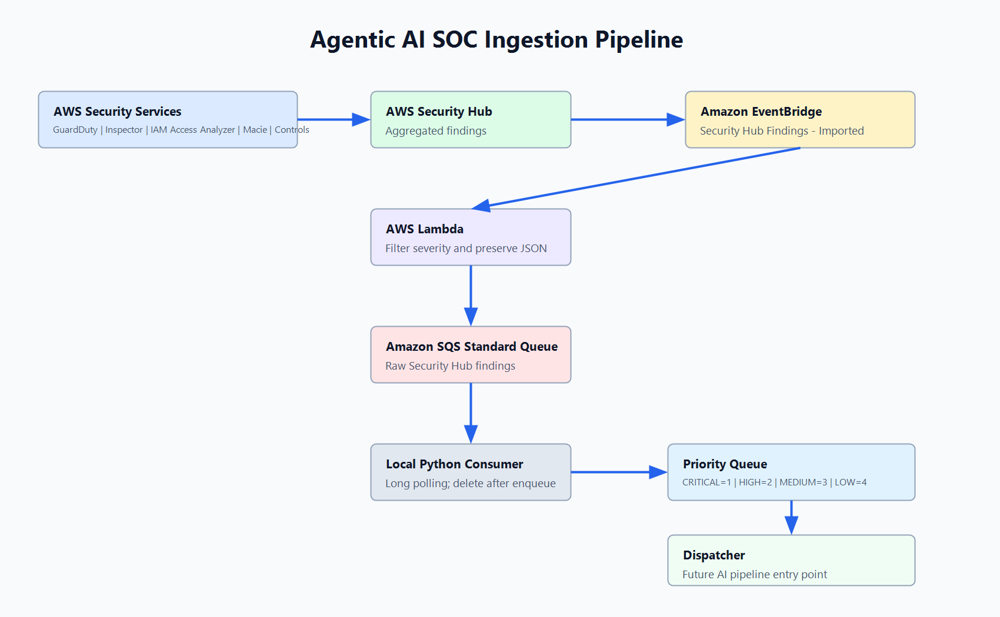

# Agentic AI SOC Security Hub Ingestion Pipeline

This project implements the AWS ingestion portion of an Agentic AI SOC platform. AWS Security Hub aggregates findings from GuardDuty, Inspector, IAM Access Analyzer, Macie, and Security Hub controls. EventBridge sends each imported finding event to Lambda, Lambda filters and forwards accepted findings to SQS, and a local Python consumer builds a priority queue for a future AI investigation pipeline.



## Architecture

```text
AWS GuardDuty
AWS Inspector
AWS IAM Access Analyzer
AWS Macie
AWS Security Hub Controls
        |
        v
AWS Security Hub
        |
        v
Amazon EventBridge
        |
        v
AWS Lambda
        |
        v
Amazon SQS Standard Queue
        |
        v
Local Python SQS Consumer
        |
        v
Priority Queue
        |
        v
Dispatcher
```

The dispatcher prints finding details and is the entry point for the future AI pipeline. The AI investigation and autonomous response system is intentionally not implemented here.

## Installation

Use Python 3.12.

```bash
cd security_pipeline/local_consumer
python -m venv .venv
.venv\Scripts\activate
pip install -r requirements.txt
```

Create a `.env` file in `security_pipeline/local_consumer`:

```env
AWS_REGION=us-east-1
AWS_ACCESS_KEY_ID=your-access-key
AWS_SECRET_ACCESS_KEY=your-secret-key
SQS_QUEUE_URL=https://sqs.us-east-1.amazonaws.com/123456789012/securityhub-raw-findings
```

`boto3` automatically reads `AWS_ACCESS_KEY_ID`, `AWS_SECRET_ACCESS_KEY`, and `AWS_REGION` from the environment. You can also use a configured AWS profile instead of static keys.

## AWS Setup

Enable AWS Security Hub and connect the source services you want to ingest:

- Amazon GuardDuty
- Amazon Inspector
- IAM Access Analyzer
- Amazon Macie
- Security Hub controls

Security Hub must be configured in the same AWS Region used by the Lambda and SQS queue unless you intentionally build a cross-Region deployment.

## IAM Permissions

The Lambda execution role needs permission to write to the SQS queue and write CloudWatch Logs.

```json
{
  "Version": "2012-10-17",
  "Statement": [
    {
      "Effect": "Allow",
      "Action": [
        "sqs:SendMessage"
      ],
      "Resource": "arn:aws:sqs:us-east-1:123456789012:securityhub-raw-findings"
    },
    {
      "Effect": "Allow",
      "Action": [
        "logs:CreateLogGroup",
        "logs:CreateLogStream",
        "logs:PutLogEvents"
      ],
      "Resource": "*"
    }
  ]
}
```

The local consumer identity needs:

```json
{
  "Version": "2012-10-17",
  "Statement": [
    {
      "Effect": "Allow",
      "Action": [
        "sqs:ReceiveMessage",
        "sqs:DeleteMessage",
        "sqs:GetQueueAttributes"
      ],
      "Resource": "arn:aws:sqs:us-east-1:123456789012:securityhub-raw-findings"
    }
  ]
}
```

## Create Queue

Create the SQS standard queue with boto3:

```python
import boto3

sqs = boto3.client("sqs", region_name="us-east-1")
response = sqs.create_queue(
    QueueName="securityhub-raw-findings",
    Attributes={
        "VisibilityTimeout": "60",
        "ReceiveMessageWaitTimeSeconds": "20"
    },
)
print(response["QueueUrl"])
```

Or create it with the AWS CLI:

```bash
aws sqs create-queue \
  --queue-name securityhub-raw-findings \
  --region us-east-1
```

Capture the returned `QueueUrl` and put it in:

- Lambda environment variable `SQS_QUEUE_URL`
- Local `.env` value `SQS_QUEUE_URL`

## Deploy Lambda

Install Lambda dependencies and package the function:

```bash
cd security_pipeline/lambda
python -m pip install -r requirements.txt -t package
copy *.py package\
powershell Compress-Archive -Path package\* -DestinationPath lambda.zip -Force
```

Create the function:

```bash
aws lambda create-function \
  --function-name securityhub-to-sqs \
  --runtime python3.12 \
  --handler lambda_function.lambda_handler \
  --zip-file fileb://lambda.zip \
  --role arn:aws:iam::123456789012:role/securityhub-to-sqs-lambda-role \
  --environment Variables="{AWS_REGION=us-east-1,SQS_QUEUE_URL=https://sqs.us-east-1.amazonaws.com/123456789012/securityhub-raw-findings}" \
  --region us-east-1
```

For updates:

```bash
aws lambda update-function-code \
  --function-name securityhub-to-sqs \
  --zip-file fileb://lambda.zip \
  --region us-east-1
```

## Create EventBridge Rule

Create a rule that listens for `Security Hub Findings - Imported`:

```bash
aws events put-rule \
  --name securityhub-findings-imported-to-lambda \
  --event-pattern "{\"source\":[\"aws.securityhub\"],\"detail-type\":[\"Security Hub Findings - Imported\"]}" \
  --region us-east-1
```

Add the Lambda target:

```bash
aws events put-targets \
  --rule securityhub-findings-imported-to-lambda \
  --targets "Id"="securityhub-to-sqs","Arn"="arn:aws:lambda:us-east-1:123456789012:function:securityhub-to-sqs" \
  --region us-east-1
```

Allow EventBridge to invoke Lambda:

```bash
aws lambda add-permission \
  --function-name securityhub-to-sqs \
  --statement-id allow-eventbridge-securityhub-findings \
  --action lambda:InvokeFunction \
  --principal events.amazonaws.com \
  --source-arn arn:aws:events:us-east-1:123456789012:rule/securityhub-findings-imported-to-lambda \
  --region us-east-1
```

## Run Local Consumer

```bash
cd security_pipeline/local_consumer
python main.py
```

The consumer uses SQS long polling:

- `WaitTimeSeconds=20`
- `VisibilityTimeout=60`
- Deletes messages only after successful JSON deserialization and priority queue insertion

Optional `.env` values:

```env
SQS_VISIBILITY_TIMEOUT=60
SQS_WAIT_TIME_SECONDS=20
SQS_MAX_MESSAGES=10
SQS_POLL_RETRY_SECONDS=5
```

## Sample Output

```text
================================================================================
Finding ID : arn:aws:securityhub:us-east-1:123456789012:subscription/aws/guardduty/GuardDutyFinding-001
Severity   : HIGH
Title      : EC2 instance is receiving brute force SSH attempts
Attack Type: TTPs/Initial Access/UnauthorizedAccess:EC2-SSHBruteForce
Resource   : arn:aws:ec2:us-east-1:123456789012:instance/i-0123456789abcdef0
================================================================================
```

## Local Test With Sample Data

You can test the Lambda handler locally by setting `SQS_QUEUE_URL` and invoking `lambda_handler` with `sample_data/securityhub_sample.json`. To avoid sending to AWS during local unit experiments, mock `sqs_sender.send_finding_to_sqs`.

## Severity Priority

The local priority queue maps Security Hub severity labels as follows:

```text
CRITICAL -> 1
HIGH     -> 2
MEDIUM   -> 3
LOW      -> 4
```

Lower numbers are dequeued first.
