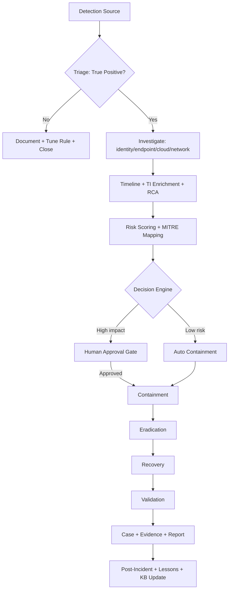
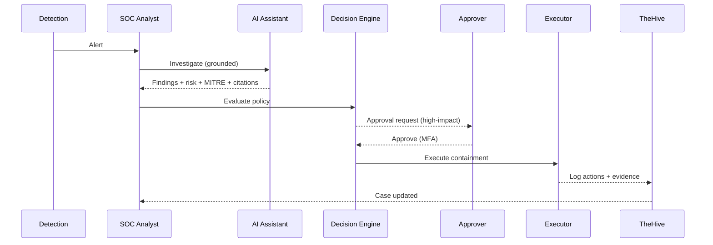
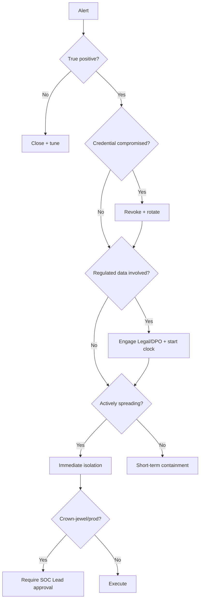
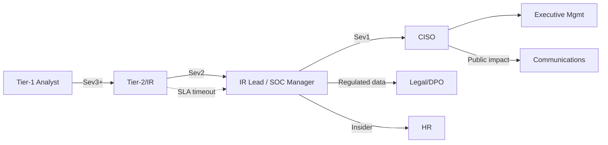

# Enterprise Incident Response Playbook

*Companion document: Enterprise Information Security & Incident Management Policy.*

**Scope:** All major cyber-attack classes. **Audience:** 24×7 SOC, Incident Response, GRC.
**Aligned to:** NIST SP 800-61r2/r3, NIST CSF 2.0, MITRE ATT&CK, MITRE D3FEND, CIS Controls v8, ISO/IEC 27001:2022 & 27002, Zero Trust (NIST SP 800-207), CSA CCM, OWASP.

> This document set is modular: **Document 1** (IR Playbook) is a universal 26-section framework; attack-specific content is delivered as **per-attack-family modules** (Ransomware, Phishing, BEC, IAM Credential Compromise, Privilege Escalation, Data Exfiltration, SQL Injection, DDoS, Insider Threat, Malware, AWS Root Compromise, Kubernetes Compromise). **Document 2** (Security Policy) governs all of them. The **Alignment Matrix** binds every playbook step to a policy requirement and control.

---

---

# DOCUMENT 1 — ENTERPRISE INCIDENT RESPONSE PLAYBOOK

## 1. Document Information

| Field | Value |
|---|---|
| Playbook Name | Enterprise Cyber Incident Response Playbook (Master) |
| Version | 1.0 |
| Owner | Head of Security Operations (SOC Manager) |
| Review Frequency | Semi-annual, and after any Severity-1/2 incident or major control change |
| Classification | Internal — Confidential |
| Scope | All production, corporate, and cloud (AWS/Azure/GCP) environments; hybrid workforce; DevSecOps pipelines; third-party integrations |
| Purpose | Provide a standardized, auditable, compliance-aligned response process for all major attack classes, executable by a 24×7 SOC with AI assistance and human-in-the-loop governance |

## 2. Executive Summary

This playbook operationalizes the NIST SP 800-61 lifecycle (Preparation → Detection & Analysis → Containment, Eradication & Recovery → Post-Incident) and maps it to NIST CSF 2.0 functions (GOVERN, IDENTIFY, PROTECT, DETECT, RESPOND, RECOVER). It defines how the SOC detects, triages, investigates, contains, eradicates, recovers from, and learns from cyber incidents across all major attack families. AI assistants accelerate analysis but never execute high-impact actions without human approval. Every action is evidence-backed, logged immutably, and traceable to a governing policy statement.

## 3. Attack Overview (per-attack module)

| Attack Family | Description | Primary Objective | Typical Entry |
|---|---|---|---|
| Ransomware | Encryption/destruction + extortion | Financial extortion | Phish, RDP, vuln, valid creds |
| Phishing | Social-engineered credential/malware delivery | Initial access | Email, SMS, IM |
| BEC | Fraudulent business email / wire fraud | Financial fraud | Account takeover, spoofing |
| IAM Credential Compromise | Stolen cloud/identity credentials abused | Access & escalation | Phish, infostealer, leaked keys |
| Privilege Escalation | Gain higher rights than granted | Control expansion | Misconfig, vuln, token abuse |
| Data Exfiltration | Bulk theft of sensitive data | Espionage/extortion | Valid creds, misconfig, insider |
| SQL Injection | Injection into data-tier via app | Data access/RCE | Vulnerable web app/API |
| DDoS | Resource exhaustion | Availability denial | Volumetric/app-layer floods |
| Insider Threat | Malicious/negligent insider action | Theft/sabotage | Legitimate access misuse |
| Malware Infection | Malicious code execution | Varies (C2, theft, mining) | Phish, drive-by, supply chain |
| AWS Root Compromise | Root/org-owner account takeover | Total cloud control | Leaked root creds, no MFA |
| Kubernetes Compromise | Cluster/API/pod takeover | Workload control, escape | Exposed API, RBAC misconfig |

## 4. Business Impact

Assessed on five axes per incident: **Confidentiality** (data class exposed), **Integrity** (data/system tampering), **Availability** (service downtime), **Financial** (fraud, ransom, fines, recovery cost), **Reputational/Regulatory** (breach notification, contractual, legal). Impact tiers drive severity (see §20 / Policy §9). Crown-jewel assets and regulated data (PII/PHI/PCI) escalate impact by policy.

## 5. Threat Model (per-attack module)

| Attack Family | Threat Actor | Key Assets at Risk | Trust Boundary Crossed |
|---|---|---|---|
| Ransomware | eCrime/RaaS affiliates | File servers, backups, VMs | Endpoint→network→storage |
| Phishing/BEC | eCrime, fraud rings | Identities, mailboxes, finance | User→IdP→apps |
| IAM Cred Compromise | eCrime, APT | Cloud identities, data stores | IdP→cloud control plane |
| Privilege Escalation | Any post-access actor | Admin planes, secrets | User→admin |
| Data Exfiltration | APT, insider, eCrime | Databases, S3, file shares | Data store→egress |
| SQL Injection | Opportunistic→targeted | App DB, secrets | Internet→app→DB |
| DDoS | Hacktivist, extortion | Public endpoints, edge | Internet→edge |
| Insider Threat | Employee/contractor | IP, customer data | Internal trust |
| Malware | eCrime, APT | Endpoints, servers | Endpoint→network |
| AWS Root | APT, eCrime | Entire cloud org | Everything |
| Kubernetes | eCrime, APT | Workloads, secrets, nodes | API→pod→node |

## 6. MITRE ATT&CK Mapping (per-attack module)

| Attack Family | Representative ATT&CK Techniques |
|---|---|
| Ransomware | T1486, T1490, T1489, T1078, T1567 |
| Phishing | T1566.001/.002, T1204, T1078 |
| BEC | T1114.003, T1534, T1586, T1078.004 |
| IAM Credential Compromise | T1078.004, T1552.001/.005, T1098, T1550 |
| Privilege Escalation | T1548, T1068, T1098, T1484 |
| Data Exfiltration | T1530, T1567.002, T1048, T1041 |
| SQL Injection | T1190, T1059, T1213 |
| DDoS | T1498, T1499 |
| Insider Threat | T1078, T1530, T1052, T1567 |
| Malware | T1204, T1055, T1071, T1105 |
| AWS Root | T1078.004, T1098, T1531 |
| Kubernetes | T1610, T1611, T1552.007, T1078 |

**D3FEND countermeasures** referenced throughout containment/eradication: Credential Eviction (D3-CE), Session Termination, Network Isolation (D3-NI), Account Locking (D3-AL), Process Termination, Restore (D3-RE).

## 7. Detection Sources

CloudTrail / cloud audit logs; GuardDuty / cloud threat detection; Security Hub aggregation; EDR/XDR; SIEM correlations; IdP logs (Okta/Entra); email security gateway; WAF/API gateway; VPC/network flow logs; IDS/IPS; DLP; CSPM (Config/Inspector/Macie); Kubernetes audit logs; honeytokens/deception; user reports; threat-intel feeds. **Policy ref:** Logging & Monitoring (Policy §7).

## 8. Trigger Conditions (per-attack module)

| Attack Family | Example Trigger |
|---|---|
| Ransomware | Rapid mass file rename/encrypt; shadow-copy deletion; ransom note |
| Phishing | User report; gateway verdict malicious; credential-harvest URL click |
| BEC | New mailbox forwarding rule + finance context; impossible-travel + payment change |
| IAM Cred Compromise | Access key used from new geo/IP; role creds used off-instance; impossible travel |
| Privilege Escalation | Admin policy attach; role binding to cluster-admin; sudo/SUID exploit |
| Data Exfiltration | Mass GetObject/DB export; large egress; DNS tunneling |
| SQL Injection | WAF injection signature; DB error spikes; anomalous query patterns |
| DDoS | Traffic volume/latency anomaly; edge saturation |
| Insider Threat | Off-hours bulk access; download-to-personal; departing-employee flag |
| Malware | EDR detection; C2 callback; suspicious process tree |
| AWS Root | Root API usage; root console login; root key creation |
| Kubernetes | Anonymous API auth; privileged pod; secret enumeration |

## 9. Indicators of Compromise (IOCs)

Standardized IOC classes captured for every incident: **Network** (IPs, domains, URLs, JA3), **Host** (file hashes, paths, registry keys, process lineage), **Identity** (user, principal, access key, token, session id), **Cloud** (ARNs, bucket, function, region, event names), **Behavioral** (impossible travel, volume/rate anomalies). IOCs are extracted automatically (IOC Extractor), enriched (§10.6), stored as TheHive observables, and shared to intel platforms. **Policy ref:** Threat Intelligence, Evidence Preservation (Policy §7).

## 10. Investigation Workflow

All investigations follow eight stages; each writes evidence to the WORM store and updates the investigation graph.

1. **Identity Investigation** — Resolve actor across IdP + cloud IAM; check auth anomalies (impossible travel, MFA status, new device), privilege level, recent grants, session/token reuse. Determine blast radius of the identity. *(D3FEND: Credential Analysis; Policy §7 Access Control, MFA, PAM.)*
2. **Endpoint Investigation** — EDR triage: process tree, persistence, injected code, credential access, lateral tooling; collect volatile + disk artifacts. *(Policy §7 Endpoint Protection.)*
3. **Cloud Investigation** — CloudTrail/config timeline; affected ARNs; IAM/policy changes; data-plane events (S3 object ops); Macie data-class; Config drift; snapshot/share changes. *(Policy §7 Cloud Security, Logging.)*
4. **Network Investigation** — Flow logs, DNS, egress volume, C2 indicators, lateral movement paths, exposed ports. *(Policy §7 Network Security.)*
5. **Timeline Reconstruction** — Merge all sources into one UTC-normalized ordered timeline with confidence per event; identify first activity and dwell time.
6. **Threat-Intelligence Enrichment** — Enrich IOCs via Cortex/VirusTotal/AbuseIPDB/GreyNoise/OTX; correlate to known actors/campaigns; map to ATT&CK. *(Policy §7 Threat Intelligence.)*
7. **Evidence Collection** — Preserve all artifacts with SHA-256, chain-of-custody, S3 Object Lock (WORM), legal hold where required. *(Policy §7 Evidence Preservation; §9.)*
8. **Root Cause Analysis** — Determine initial access vector, exploited weakness, and control failure; feed Lessons Learned and control remediation.

## 11. Decision Tree (analyst guidance)

- **Is the alert a true positive?** No → document + suppress with rule tuning proposal → close. Yes → continue.
- **Is an identity/credential compromised?** Yes → revoke sessions + rotate credentials (immediate containment) → continue. No → continue.
- **Is data of a regulated class involved (Macie/DLP)?** Yes → engage Legal/DPO, start breach-notification clock, escalate severity. No → continue.
- **Is the threat actively spreading (lateral movement / active C2 / active encryption)?** Yes → isolate affected hosts/accounts immediately (auto for low-risk, approval for high-impact). No → proceed to short-term containment.
- **Is confidence low / evidence insufficient?** Escalate to Tier-3 / IR Lead; request more context; do not auto-act.
- **Is the affected asset a crown jewel / production-critical?** Yes → require SOC Lead approval before destructive action; involve System Owner.

## 12. Containment

**Immediate (minutes):** revoke sessions/tokens; disable compromised credentials/keys; isolate host (network quarantine); block malicious IP/domain; disable malicious mailbox rules; snapshot for forensics before change. *(D3-CE, D3-NI, D3-AL. Policy §7 Access Control, Incident Reporting.)*
**Short-term (hours):** scope blast radius; contain lateral paths; apply WAF/SG rules; suspend affected pipelines; quarantine artifacts; restrict exposed resources.
**Long-term (days):** enforce architectural fixes (IMDSv2, MFA, segmentation, least privilege); rotate all potentially exposed secrets; re-baseline detections.

## 13. Eradication

Remove persistence (rogue IAM users/keys, scheduled tasks, web shells, run-keys, malicious layers/images); patch exploited vulnerabilities; rebuild/reimage compromised hosts from known-good; reset affected credentials org-wide; for AD compromise reset krbtgt twice; invalidate and reissue tokens/certs. Verify no residual attacker access before recovery. *(D3FEND Eviction; Policy §7 Patch Management, Credential Management.)*

## 14. Recovery

Restore services from validated clean backups (integrity-checked); re-enable accounts with new credentials + MFA; gradually restore connectivity under monitoring; confirm business function; heightened monitoring for recurrence for a defined watch period. *(Policy §7 Backup & Recovery, Business Continuity, Disaster Recovery; §9 recovery times.)*

## 15. Validation

Confirm: attacker access eradicated; vulnerabilities remediated; detections in place for the observed TTPs; backups/restores verified; IOCs blocked; no anomalous activity during watch window; stakeholders sign off. A Severity-1/2 requires IR Lead + System Owner validation sign-off before closure.

## 16. Post-Incident Activities

Within defined SLA (Policy §9): produce final incident report; conduct blameless post-incident review; capture Lessons Learned; open remediation tickets (detection gaps, control failures, process fixes) with owners and due dates; update playbook/policy; update RAG knowledge base; report metrics; regulatory/contractual notifications as required.

## 17. AI Investigation Assistant (prompts)

All AI outputs are grounded (RAG), cited, confidence-scored, human-reviewed; AI never executes high-impact actions.

- **Executive summary:** *"Summarize this incident in 3 sentences for executives: what happened, business impact, and current status. No jargon. State the single most important number."*
- **Technical summary:** *"Produce a technical incident summary: attack chain, ATT&CK techniques with evidence citations, IOCs, affected assets, actions taken, and residual risk."*
- **Risk assessment:** *"Assess risk using asset criticality, data classification, identity privilege, and TI verdicts. Output severity band, confidence, and the top three risk factors with weights."*
- **MITRE mapping:** *"Map the observed behaviors to MITRE ATT&CK tactics/techniques. For each, cite the supporting evidence id and a confidence score. Flag anything unmappable."*
- **Containment recommendations:** *"Given the evidence, recommend an ordered containment plan. For each action state target, blast radius, reversibility, risk tier, and whether human approval is required."*
- **Recovery recommendations:** *"Recommend a recovery plan: restore order, prerequisites (clean backup verification), credential resets, validation checks, and the monitoring watch period."*

## 18. Automation Opportunities

| Layer | Automation |
|---|---|
| Lambda | Executors: disable key, revoke sessions, isolate instance, revoke SG rule, quarantine email, rotate secret; enrichment fetchers |
| EventBridge | Event-driven trigger + step choreography; DLQ; archive/replay for audit |
| SOAR | Orchestration, approval routing (waitForTaskToken), playbook selection |
| TheHive | Case creation, observables, tasks, TTPs, audit trail; Cortex enrichment |
| Slack | Interactive approvals, incident channel auto-provision, notifications |
| Microsoft Teams | Adaptive-card approvals + notifications (parity with Slack) |
| Jira | Auto-ticket for remediation, tracking, SLA timers |

Autonomy is graded: low-risk actions auto-execute; medium/high-impact require human approval (Policy §7 Privileged Access, §9 Escalation).

## 19. Dashboard Components

Live incident queue (severity, state, SLA timers); risk score + factor breakdown; unified timeline; ATT&CK coverage heatmap; identity/asset blast-radius graph; action status (queued→running→verified) + approvals; IOC table with TI verdicts; evidence vault with hashes; KPI tiles + trends; per-attack-family incident volume.

## 20. KPIs

| KPI | Definition | Target |
|---|---|---|
| MTTD | Mean time to detect (attacker start → alert) | ↓ trend; < 1 h critical |
| MTTR | Mean time to respond/resolve | Sev1 < 4 h; Sev2 < 24 h |
| Containment Time | Trigger → first effective containment | Sev1 < 30 min |
| Recovery Time | Containment → validated service restoration | Per BC/DR RTO |
| Automation Rate | % actions auto-executed (of eligible) | > 60% |
| False Positive Rate | FP / total alerts triaged | < 10% |

Severity levels (Sev1–Sev4) and response times are defined in Policy §9.

## 21. Evidence Checklist

☐ Raw triggering finding(s) ☐ Correlated cloud audit events ☐ Identity/auth logs ☐ Endpoint forensic capture (memory+disk) ☐ Network flow/DNS/PCAP ☐ Affected resource config snapshot ☐ Data-classification (Macie/DLP) results ☐ TI enrichment responses ☐ Unified timeline ☐ AI reasoning trace ☐ Action + approval records ☐ Communications log ☐ All hashed (SHA-256) + WORM-locked + custody log ☐ Legal hold applied (if regulated data). *(Policy §7 Evidence Preservation; §9 retention.)*

## 22. Communication Plan

| Audience | Trigger | Channel | Timing | Owner |
|---|---|---|---|---|
| SOC/IR team | Any incident | Incident channel | Immediate | SOC Analyst |
| IT/System Owner | Affected system | Ticket + call | ≤ SLA | Incident Responder |
| Executive Mgmt | Sev1/Sev2 | Briefing | ≤ 1 h (Sev1) | SOC Manager |
| Legal/DPO | Regulated data/breach | Secure email/call | ≤ policy clock | IR Lead |
| HR | Insider/employee | Confidential | As needed | IR Lead + HR |
| Comms/PR | Public/customer impact | Approved statement | Per Legal | Communications |
| Customers/Regulators | Breach notification | Formal notice | Per regulation | Legal + Exec |

Internal vs external comms are segregated; only approved spokespeople communicate externally. *(Policy §7 Communication, Regulatory Compliance.)*

## 23. Escalation Matrix

| Severity | Criteria | Initial Owner | Escalate To | Notify |
|---|---|---|---|---|
| Sev1 Critical | Active breach of crown-jewel/regulated data; org-wide; ransomware; root compromise | IR Lead | CISO + Exec + Legal | War room, 24×7 bridge |
| Sev2 High | Confirmed compromise, contained scope | Incident Responder | IR Lead / SOC Manager | Exec brief |
| Sev3 Medium | Suspected/limited compromise | Tier-2 Analyst | Incident Responder | System Owner |
| Sev4 Low | Policy/config issue, no compromise | Tier-1 Analyst | Tier-2 | Ticket only |

SLA timers per severity are defined in Policy §9; timeout auto-escalates to the next tier.

## 24. Compliance Considerations

Breach-notification obligations (GDPR 72 h, and other applicable regimes) tracked from confirmation; evidence retained per legal/regulatory minimums; PCI-DSS (if card data), HIPAA (if PHI), SOX (if financial systems) considerations flagged automatically by data class; audit trail satisfies ISO 27001 A.5.28 (evidence) and SOC 2 CC7. All handled via Policy §7 Regulatory Compliance and §9.

## 25. Lessons Learned

Blameless review captures: what happened, timeline, root cause, what worked, what failed, detection/control gaps, and prioritized improvement actions (with owners + due dates). Proposed detection/policy changes require review before promotion. Findings update playbooks, policy, detections, and the RAG knowledge base.

## 26. References

NIST SP 800-61 (r2/r3) Computer Security Incident Handling; NIST CSF 2.0; NIST SP 800-207 Zero Trust; MITRE ATT&CK (Enterprise & Cloud); MITRE D3FEND; CIS Controls v8; ISO/IEC 27001:2022 & 27002:2022; CSA Cloud Controls Matrix (CCM) v4; OWASP Top 10 / API Security Top 10; AWS Security Incident Response Guide.

---

---

# ALIGNMENT MATRIX (Playbook ↔ Policy ↔ Control)

| Playbook Step | Policy Requirement | Security Control | Owner |
|---|---|---|---|
| §7 Detection Sources | §7 Detection, Logging, Monitoring | CIS 8; NIST DE.CM; ISO A.8.15 | Security Engineer |
| §8 Trigger Conditions | §7 Detection; §9 response times | CIS 8/13; NIST DE.AE | SOC Analyst |
| §9 IOCs | §7 Threat Intelligence, Evidence Preservation | CIS 7/13; NIST ID.RA; ISO A.5.7 | SOC Analyst |
| §10.1 Identity Investigation | §7 Access Control, MFA, PAM | CIS 5/6; NIST PR.AA; D3FEND Credential Analysis; ISO A.5.15–A.5.17 | Incident Responder |
| §10.2 Endpoint Investigation | §7 Endpoint Protection | CIS 10; NIST DE.CM; ISO A.8.7 | Incident Responder |
| §10.3 Cloud Investigation | §7 Cloud Security, Logging | CIS 8; NIST DE.CM; CSA CCM; ISO A.8.15 | Cloud Administrator |
| §10.4 Network Investigation | §7 Network Security | CIS 4/12/13; NIST PR.IR; ISO A.8.20 | Security Engineer |
| §10.7 Evidence Collection | §7 Evidence Preservation; §9 retention | NIST RS.AN; ISO A.5.28; SOC 2 CC7 | Incident Responder |
| §10.8 Root Cause Analysis | §7 Patch Mgmt; §14 review | CIS 7; NIST ID.RA; ISO A.8.8 | Security Engineer |
| §12 Containment | §7 Access Control, Incident Reporting; §9 containment SLA | CIS 4/5; NIST RS.MI; D3FEND CE/NI/AL | Incident Responder |
| §13 Eradication | §7 Credential Mgmt, Patch Mgmt | CIS 4/7; NIST RS.MI; D3FEND Eviction | Security Engineer |
| §14 Recovery | §7 Backup & Recovery, BC/DR | CIS 11; NIST RC.RP; ISO A.8.13 | IT Operations |
| §15 Validation | §12 Compliance Verification | NIST RC.RP; ISO A.5.24 | IR Lead |
| §16/§25 Post-Incident/Lessons | §14 Review; §13 Audit | NIST RS.IM/RC.IM; ISO A.5.27 | SOC Manager |
| §17 AI Assistant (approvals) | §7 Privileged Access; §9 escalation | NIST PR.AA; Zero Trust | SOC Lead |
| §18 Automation | §7 Monitoring; §9 response times | CIS 17; NIST RS.MA | Security Engineer |
| §20 KPIs | §12 Compliance Verification; §13 Audit | NIST GV; SOC 2 | SOC Manager |
| §22 Communication | §7 Communication, Regulatory Compliance | ISO A.5.24; GDPR/HIPAA/PCI | Communications/Legal |
| §23 Escalation | §9 Escalation criteria & severity | NIST RS.CO; ISO A.5.24 | IR Lead |
| §24 Compliance | §7 Regulatory Compliance; §9 notification | ISO A.5.31; GDPR Art.33 | Legal |

---

# IMPLEMENTATION ARTIFACTS

## 1. Incident Response Workflow (Mermaid)



## 2. Sequence Diagram (Mermaid)



## 3. Decision Tree (Mermaid)



## 4. Escalation Flow (Mermaid)



## 5. YAML Playbook Definition

```yaml
apiVersion: sentinelx/v1
kind: IncidentResponsePlaybook
metadata: { name: master-ir-playbook, version: 1, classification: internal-confidential, owner: soc-manager }
lifecycle: [preparation, detection_analysis, containment_eradication_recovery, post_incident]
severity_slas:
  sev1: { respond_min: 15, contain_min: 30, notify_exec_min: 60 }
  sev2: { respond_min: 30, contain_min: 120 }
  sev3: { respond_min: 120 }
  sev4: { respond_min: 480 }
stages:
  - id: triage        { policy: [detection], control: [CIS-8] }
  - id: investigate   { substeps: [identity, endpoint, cloud, network, timeline, ti, evidence, rca] }
  - id: decide        { engine: policy, autonomy: graded, hitl: true }
  - id: contain       { tiers: [immediate, short_term, long_term], d3fend: [D3-CE, D3-NI, D3-AL] }
  - id: eradicate     { policy: [credential_mgmt, patch_mgmt] }
  - id: recover       { policy: [backup_recovery, bcdr] }
  - id: validate
  - id: post_incident { outputs: [report, lessons, kb_update, metrics] }
approvals:
  high_impact: { role: soc_lead, mfa: true, four_eyes: true }
integrations: { case: thehive, chat: [slack, teams], ticket: jira, orchestration: soar }
```

## 6. JSON Incident Schema

```json
{
  "$schema": "https://json-schema.org/draft/2020-12/schema",
  "title": "Incident",
  "type": "object",
  "required": ["incident_id","attack_family","severity","state","detected_at"],
  "properties": {
    "incident_id": {"type":"string"},
    "attack_family": {"enum":["ransomware","phishing","bec","iam_credential_compromise",
      "privilege_escalation","data_exfiltration","sql_injection","ddos","insider_threat",
      "malware","aws_root_compromise","kubernetes_compromise"]},
    "severity": {"enum":["sev1","sev2","sev3","sev4"]},
    "state": {"enum":["triage","investigating","contained","eradicated","recovered","closed"]},
    "detected_at": {"type":"string","format":"date-time"},
    "mitre_techniques": {"type":"array","items":{"type":"string"}},
    "iocs": {"type":"array","items":{"type":"object"}},
    "assets": {"type":"array"}, "identities": {"type":"array"},
    "actions": {"type":"array"}, "approvals": {"type":"array"},
    "evidence": {"type":"array","items":{"type":"object",
      "properties":{"s3":{"type":"string"},"sha256":{"type":"string"}}}},
    "regulated_data": {"type":"boolean"},
    "notifications": {"type":"array"}, "kpis": {"type":"object"}
  }
}
```

## 7. REST API Examples

```http
POST /api/v1/incidents           # create incident from a trigger
GET  /api/v1/incidents/{id}       # full incident record + graph
GET  /api/v1/incidents/{id}/timeline
POST /api/v1/incidents/{id}/actions      { "action_id":"a1","decision":"approve","mfa":true }
POST /api/v1/incidents/{id}/containment  { "type":"disable_access_key","target":"AKIA...","approved_by":"soc_lead" }
GET  /api/v1/incidents/{id}/report?type=executive|technical
POST /api/v1/incidents/{id}/close        { "validation_signoff":"ir_lead" }
```

## 8. Dashboard Wireframe

```
+------------------------------------------------------------------+
| SOC Command Center     Sev1:1  Sev2:3   MTTD 42m  MTTR 3.1h      |
+-------------+----------------------------------------------------+
| QUEUE (SLA) |  Incident inc_... [IAM Cred Compromise]  RISK 92   |
|  !Sev1 02:41|  Timeline | ATT&CK heatmap | Blast-radius graph    |
|   Sev2 ...  |  Actions: [Approve] Disable key  [Approve] Block IP|
| FILTERS     |  IOCs (TI verdicts)   Evidence vault (hashes)      |
| family/state|  KPI tiles: MTTD MTTR Contain Recover Auto% FP%    |
+-------------+----------------------------------------------------+
```

## 9. Investigation Checklist

☐ Confirm true positive ☐ Identify attack family ☐ Resolve identities + privilege ☐ Endpoint triage ☐ Cloud audit timeline ☐ Network/egress review ☐ Extract + enrich IOCs ☐ Build unified timeline ☐ Determine data classification ☐ Assess blast radius ☐ Map MITRE ☐ Compute severity ☐ Decide containment path ☐ Collect + hash evidence ☐ Root cause ☐ Approvals recorded ☐ Notifications sent ☐ Report generated.

## 10. Executive One-Page Summary

**Incident Response at a glance.** We run a 24×7, AI-assisted, human-governed incident response capability covering every major attack class. Detection spans endpoint, identity, network, cloud, and application layers. On any alert, the SOC (aided by grounded AI) investigates across all evidence, scores risk deterministically, and follows a policy-bound decision tree: low-risk containment is automated, high-impact actions require authenticated human approval. Every action is evidence-backed, immutably logged, and traceable to a governing policy statement and control (NIST, CIS, ISO, MITRE). We measure MTTD, MTTR, containment/recovery time, automation rate, and false-positive rate, and improve after every incident. Regulated-data incidents trigger Legal engagement and breach-notification timelines automatically. **Bottom line:** faster detection and response, governed autonomy, full auditability, and demonstrable compliance.

---

*End of document set. Both documents and the alignment matrix are mutually consistent: every playbook activity (Doc 1) is mandated by a policy statement (Doc 2) and mapped to a recognized control.*


